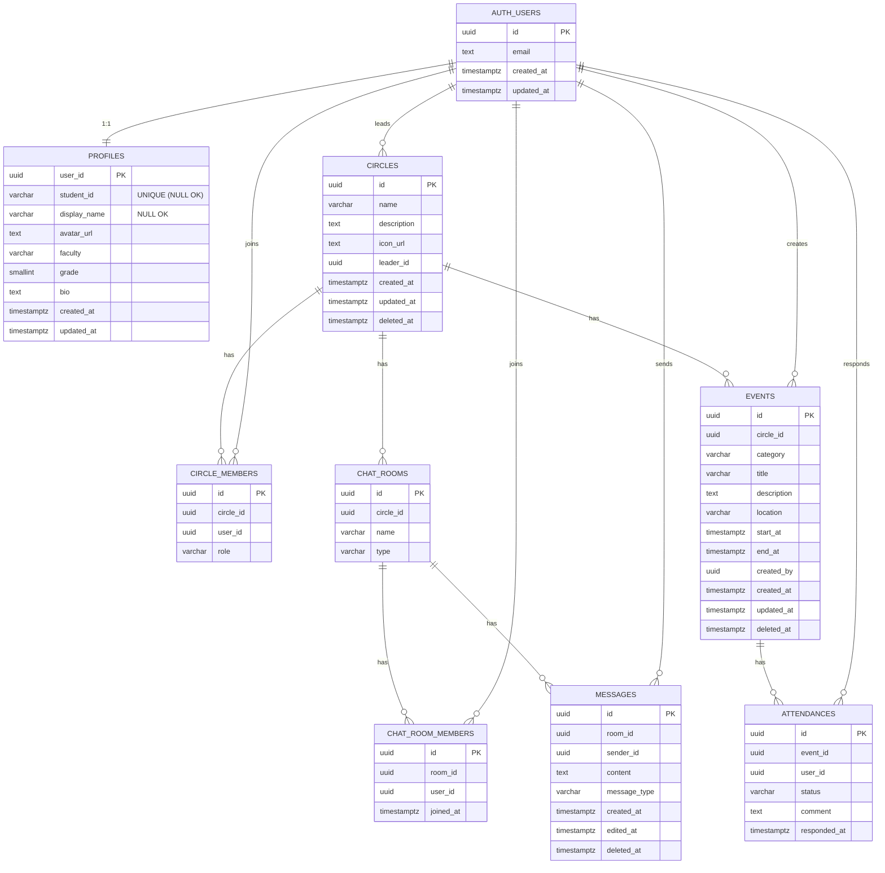

# ER（A案: auth.users + profiles）

```mermaid
erDiagram
  AUTH_USERS {
    uuid id PK
    text email
    timestamptz created_at
    timestamptz updated_at
  }

  PROFILES {
    uuid user_id PK
    varchar student_id "UNIQUE (NULL OK)"
    varchar display_name "NULL OK"
    text avatar_url
    varchar faculty
    smallint grade
    text bio
    timestamptz created_at
    timestamptz updated_at
  }

  CIRCLES {
    uuid id PK
    varchar name
    text description
    text icon_url
    uuid leader_id
    timestamptz created_at
    timestamptz updated_at
    timestamptz deleted_at
  }

  CIRCLE_MEMBERS {
    uuid id PK
    uuid circle_id
    uuid user_id
    varchar role
  }

  CHAT_ROOMS {
    uuid id PK
    uuid circle_id
    varchar name
    varchar type
  }

  CHAT_ROOM_MEMBERS {
    uuid id PK
    uuid room_id
    uuid user_id
    timestamptz joined_at
  }

  MESSAGES {
    uuid id PK
    uuid room_id
    uuid sender_id
    text content
    varchar message_type
    timestamptz created_at
    timestamptz edited_at
    timestamptz deleted_at
  }

  EVENTS {
    uuid id PK
    uuid circle_id
    varchar category
    varchar title
    text description
    varchar location
    timestamptz start_at
    timestamptz end_at
    uuid created_by
    timestamptz created_at
    timestamptz updated_at
    timestamptz deleted_at
  }

  ATTENDANCES {
    uuid id PK
    uuid event_id
    uuid user_id
    varchar status
    text comment
    timestamptz responded_at
  }

  AUTH_USERS ||--|| PROFILES : "1:1"
  AUTH_USERS ||--o{ CIRCLES : "leads"
  CIRCLES ||--o{ CIRCLE_MEMBERS : "has"
  AUTH_USERS ||--o{ CIRCLE_MEMBERS : "joins"

  CIRCLES ||--o{ CHAT_ROOMS : "has"
  CHAT_ROOMS ||--o{ CHAT_ROOM_MEMBERS : "has"
  AUTH_USERS ||--o{ CHAT_ROOM_MEMBERS : "joins"
  CHAT_ROOMS ||--o{ MESSAGES : "has"
  AUTH_USERS ||--o{ MESSAGES : "sends"

  CIRCLES ||--o{ EVENTS : "has"
  AUTH_USERS ||--o{ EVENTS : "creates"
  EVENTS ||--o{ ATTENDANCES : "has"
  AUTH_USERS ||--o{ ATTENDANCES : "responds"
```
